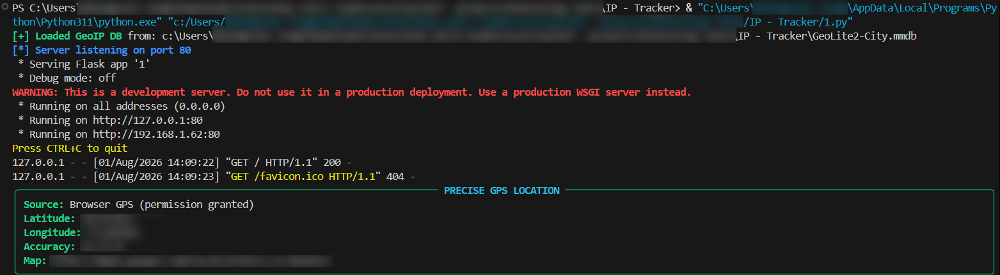
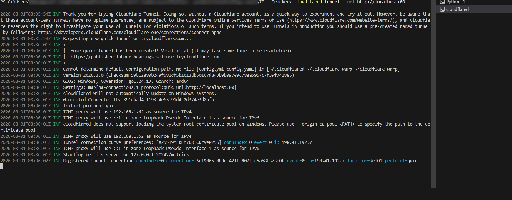
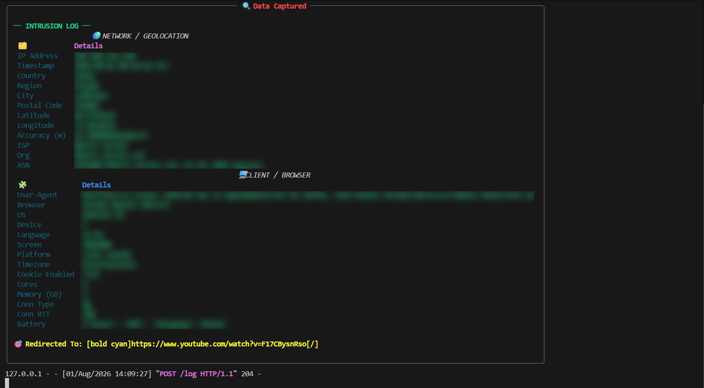
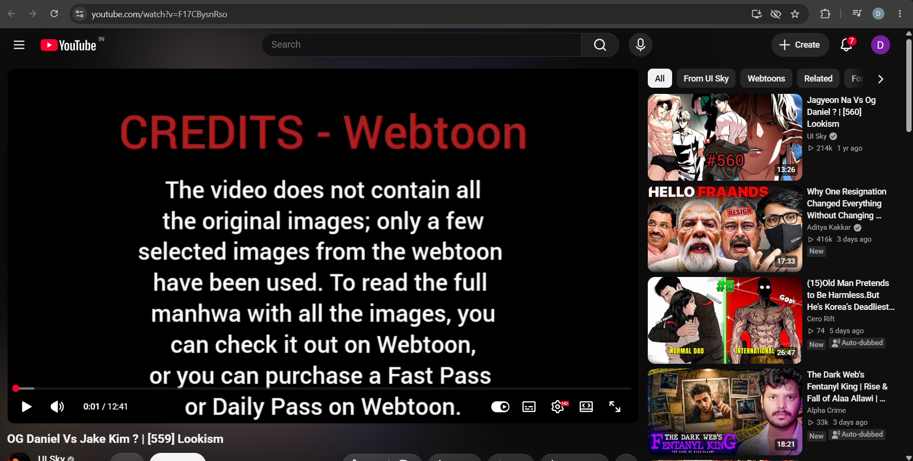

<div align="center">

# 🛰️ IP Tracker

### A Professional Flask-Based IP & Browser Telemetry Demonstration Tool

[](https://python.org)
[](https://flask.palletsprojects.com/)
[](LICENSE)
[]()
[]()
[]()

> **Professional IP Geolocation & Browser Telemetry Demonstration Tool for Authorized Cybersecurity Testing**

</div>

---

# ⚠️ Legal Notice

> **This project is intended exclusively for authorized cybersecurity activities.**

Use this software **only** with explicit permission from the owner of the system or participant.

This project **must not** be used for:

- Unauthorized tracking
- Phishing
- Surveillance
- Stalking
- Harassment
- Doxxing
- Privacy violations
- Identity discovery
- Illegal data collection

The author assumes **no responsibility** for misuse.

---

# ✨ Features

## 🌍 Network Intelligence

- Public IP Detection
- Country Detection
- Region & State Lookup
- City Detection
- Postal Code
- Latitude & Longitude
- Timezone Detection

---

## 🛰️ Geolocation

- MaxMind GeoLite2 Database
- Online IP Enrichment
- ISP Detection
- ASN Lookup
- Organization Detection

---

## 📱 Browser Fingerprinting

- Browser Name
- Browser Version
- Device Type
- Operating System
- User Agent
- Language
- Screen Resolution
- Platform
- Timezone

---

## 📍 GPS Collection

When permission is granted:

- GPS Latitude
- GPS Longitude
- Accuracy
- Timestamp

Otherwise the application falls back to IP-based geolocation.

---

# 📸 Demonstration Workflow

The screenshots below demonstrate the application's workflow in an **authorized cybersecurity testing environment**.

---

## 🚀 1. Server Startup

The application loads the GeoLite2 database and starts the Flask server.

<p align="center">

</p>

---

## 🌐 2. Cloudflare Tunnel (Optional)

For demonstrations or authorized remote testing, the application can be exposed using Cloudflare Tunnel.

<p align="center">

</p>

---

## 📊 3. Telemetry Captured

After the participant visits the application and grants any requested permissions, collected telemetry is displayed in the terminal.

<p align="center">

</p>

---

## 🎥 4. Redirect

After telemetry collection, the visitor is redirected to the configured destination.

<p align="center">

</p>

---

# 📝 Logging

Every visit is stored as a daily JSONL log.

```
logs/
└── YYYY-MM-DD.jsonl
```

Each event includes:

- Timestamp
- IP Address
- Geolocation
- Browser Information
- Device Information
- GPS Coordinates (If Granted)
- ISP Information

---

# 📦 Project Structure

```
IP-Tracker/

├── assets/
│   ├── server-start.png
│   ├── cloudflare-tunnel.png
│   ├── terminal-output.png
│   └── redirect-demo.png
│
├── logs/
│
├── GeoLite2-City.mmdb
├── requirements.txt
├── README.md
├── LICENSE
└── tracker.py
```

---

# 🚀 Installation

Clone the repository

```bash
git clone https://github.com/DhamrpreetSingh/IP-Tracker.git

cd IP-Tracker
```

Create Virtual Environment

```bash
python -m venv .venv
```

Windows

```powershell
.\.venv\Scripts\Activate.ps1
```

Linux/macOS

```bash
source .venv/bin/activate
```

Install Requirements

```bash
pip install -r requirements.txt
```

---

# 🌍 GeoLite2 Database

Download the **GeoLite2 City** database from MaxMind.

https://www.maxmind.com/en/geolite2/signup

Place

```
GeoLite2-City.mmdb
```

inside the project folder.

---

# ⚙️ Configuration

Edit inside `tracker.py`

```python
YOUTUBE_URL="https://www.youtube.com/watch?v=F17CBysnRso"

LOG_DIR="logs"

GEO_DB_PATH="GeoLite2-City.mmdb"
```

For local testing

```python
app.run(host="127.0.0.1",port=5000)
```

---

# ▶️ Running

```bash
python tracker.py
```

Open

```
http://127.0.0.1:5000
```

---

# 📊 Information Collected

| Category | Information |
|-----------|-------------|
| Network | IP Address |
| Country | Country |
| Region | Region |
| City | City |
| Postal Code | Postal Code |
| Geo | Latitude |
| Geo | Longitude |
| Geo | Timezone |
| ISP | ISP |
| ISP | ASN |
| ISP | Organization |
| Browser | Browser |
| Browser | Version |
| Browser | User-Agent |
| Browser | Platform |
| Browser | Screen Resolution |
| Browser | Language |
| Browser | Device Type |
| Browser | Timezone |
| GPS | Latitude *(Permission Required)* |
| GPS | Longitude *(Permission Required)* |
| GPS | Accuracy |

---

# 🔐 Security Recommendations

For authorized deployments:

- HTTPS
- Authentication
- Authorization
- Rate Limiting
- Secure Logging
- Reverse Proxy
- Input Validation
- Data Retention Policy

Never trust

- X-Forwarded-For
- Client Headers
- Browser Fingerprints Alone

---

# 📚 Educational Use Cases

- Cybersecurity Labs
- Security Awareness Demonstrations
- Browser Privacy Demonstrations
- Red Team Training
- Blue Team Training
- Geolocation Demonstrations
- University Projects
- Authorized Penetration Testing

---

# 📄 Example Log

```json
{
  "timestamp":"2026-08-01T10:52:41Z",
  "ip":"203.0.113.15",
  "country":"India",
  "city":"Delhi",
  "browser":"Chrome",
  "gps":null
}
```

---

# ⚠️ Privacy

This application processes personal information.

Participants should always be informed of:

- What data is collected
- Why it is collected
- Where it is stored
- Who can access it
- Data retention period
- Deletion process

GPS coordinates are collected **only after explicit browser permission is granted.**

---

# 📜 License

Licensed under the **MIT License**.

Third-party services remain under their own licenses.

- MaxMind GeoLite2
- ip-api.com
- OpenStreetMap / Nominatim

---

# 👨‍💻 Author

## Dharmpreet Singh (Gh0$t)

**Cybersecurity Researcher**

- Offensive Security
- Web Application Security
- AI Security
- Red Teaming

---

<div align="center">

### ⭐ Star this repository if you found it useful!

*"Knowledge is most valuable when used responsibly."*

</div>
